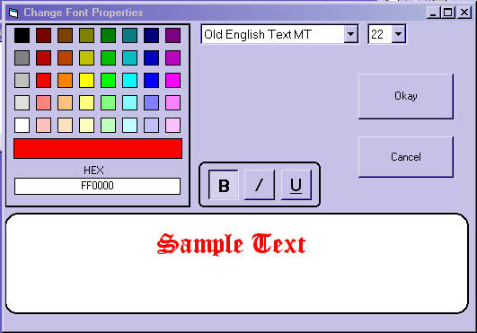



## Change Font Properties Form

### Description

This is a total remake of my earlier submission. It lets you change your font properties within your app. Hope someone finds a use for it. Real simple code.
 
### More Info
 

             |
---                |---
**Submitted On**   |2003-10-14 19:45:32
**By**             |[Kenneth Foster](https://github.com/Planet-Source-Code/PSCIndex/blob/master/ByAuthor/kenneth-foster.md)
**Level**          |Beginner
**User Rating**    |4.0 (16 globes from 4 users)
**Compatibility**  |VB 6\.0
**Category**       |[Custom Controls/ Forms/  Menus](https://github.com/Planet-Source-Code/PSCIndex/blob/master/ByCategory/custom-controls-forms-menus__1-4.md)
**World**          |[Visual Basic](https://github.com/Planet-Source-Code/PSCIndex/blob/master/ByWorld/visual-basic.md)
**Archive File**   |[Change\_Fon16587410142003\.zip](https://github.com/Planet-Source-Code/kenneth-foster-change-font-properties-form__1-49226/archive/master.zip)

